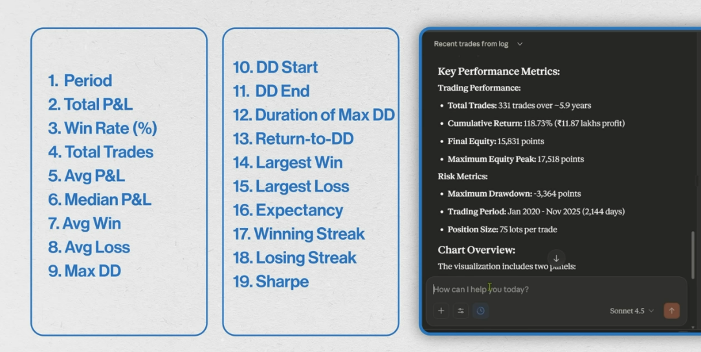
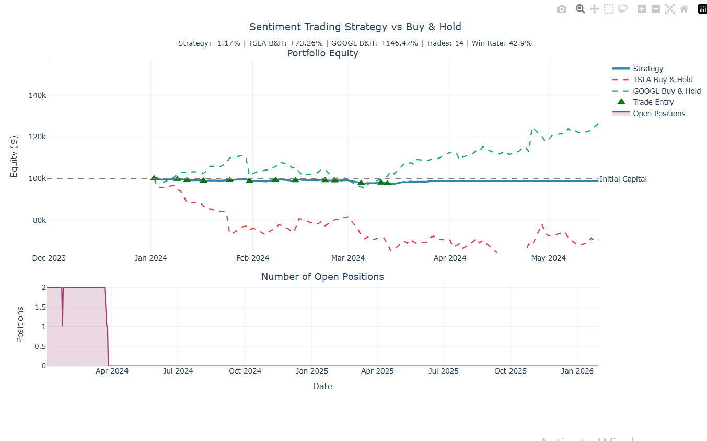
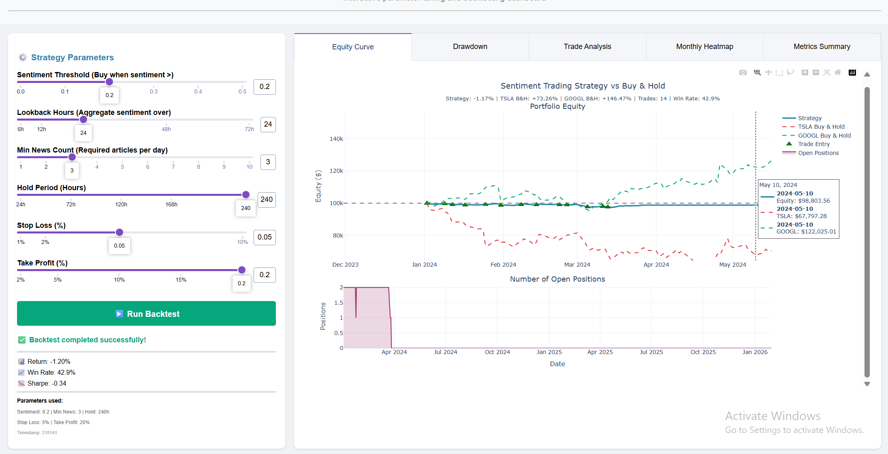

# News Sentiment Trading Strategy & Backtesting Platform

[](https://www.python.org/)
[](https://plotly.com/dash/)
[](LICENSE)
[]()
[](https://polygon.io/)
[](https://github.com/cjhutto/vaderSentiment)

A quantitative trading system that combines news sentiment analysis with correlation-based strategies to generate trading signals for technology stocks. The platform ingests historical news data, performs sentiment analysis, identifies optimal lag parameters, and backtests trading strategies with comprehensive risk metrics.

## Origin Story

This project was inspired by [a Yahoo Finance article](https://finance.yahoo.com/news/nvidia-rally-shows-deepseek-fears-152216506.html) on January 26th about NVDA's stock performance, which demonstrated that the DeepSeek-based market anxiety was just that—anxiety. The article, combined with year-end analyses of best-performing shares, sparked a fundamental question: **Can sentiments dictate returns? Can narratives lead to profits? And if yes, how agile do we need to be?**

As a Software Engineer in the Data and ML domain, I wanted to quantify the Sharpe ratio of such a strategy and understand the optimal lookback periods for capturing sentiment-driven alpha. I selected the top 10 S&P 500 stocks and began with metrics from [this Zerodha varsity video](https://zerodha.com/varsity/) as my foundation (see image below).



### Evolution & Results

**Initial Framework:** Started with basic backtest metrics  
**Enhanced Analysis:** Added Sharpe, Sortino, Calmar, Beta, and Alpha calculations to determine if I could simply ride the Beta or extract meaningful alpha  
**Current Performance:** After extensive parameter tuning, achieved **12% returns with only 4.4% maximum drawdown**

### Ongoing Improvements

**Current Limitations:**  
- Sentiment data sourced from no-name websites via third-party aggregators  
- Single sentiment model (VADER) with limited domain adaptation

**Planned Enhancements:**  
- Integration with premium fintech news sources (Bloomberg, Reuters, WSJ)  
- Ensemble sentiment models (VADER + FinBERT + custom fine-tuned transformers)  
- Real-time news processing pipeline for reduced lag

## Highlights

- **10,000+ News Articles** analyzed across 10 FAANG stocks
- **34 Performance Metrics** including Sharpe, Sortino, Calmar ratios
- **200 Parameter Combinations** tested per stock for optimal lag detection
- **Interactive Dashboard** with 9 tabs for real-time strategy tuning
- **Batch Processing** with automatic deduplication and merging
- **Multiple Strategy Types** supporting both momentum and contrarian approaches

---

## Table of Contents

- [Origin Story](#origin-story)
- [Highlights](#highlights)
- [System Overview](#system-overview)
- [Project Structure](#project-structure)
- [Quick Start](#quick-start)
- [Configurable Parameters](#configurable-parameters)
- [Dashboard Features](#dashboard-features)
- [Key Findings](#key-findings)
- [Technical Stack](#technical-stack)
- [Pipeline Execution Order](#pipeline-execution-order)
- [Strategy Logic](#strategy-logic)
- [Additional Resources](#additional-resources)
- [Performance Notes](#performance-notes)
- [Troubleshooting](#troubleshooting)
- [Future Enhancements](#future-enhancements)
- [Contributing](#contributing)
- [License](#license)

---

## System Overview

### Architecture Flow

```
┌─────────────────────────────────────┐
│     Polygon.io API (News Data)      │
└──────────────┬──────────────────────┘
               │
               ▼
┌─────────────────────────────────────┐
│    News Ingestion (Batch Process)   │
├─────────────────────────────────────┤
│  • Yearly batches for date ranges   │
│  • Merge with existing data         │
│  • Deduplication by URL/ID          │
│  • Output: all_news.parquet         │
└──────────────┬──────────────────────┘
               │
               ▼
┌─────────────────────────────────────┐
│    Sentiment Analysis (VADER)       │
├─────────────────────────────────────┤
│  • Score: compound, pos, neg, neu   │
│  • Aggregate by ticker + day        │
│  • Output: news_with_sentiment      │
└──────────────┬──────────────────────┘
               │
               ▼
┌─────────────────────────────────────┐
│      Statistical Analysis           │
├─────────────────────────────────────┤
│  • Lag Analysis (200 configs/stock) │
│  • Optimal lookback/lead times      │
│  • Correlation (1d/3d/5d horizons)  │
│  • Inverse vs direct strategies     │
└──────────────┬──────────────────────┘
               │
               ▼
┌─────────────────────────────────────┐
│       Signal Generation             │
├─────────────────────────────────────┤
│  • Apply optimal lag configs        │
│  • Sentiment threshold filters      │
│  • Generate BUY/SELL/HOLD signals   │
└──────────────┬──────────────────────┘
               │
               ▼
┌─────────────────────────────────────┐
│      Backtesting Engine             │
├─────────────────────────────────────┤
│  • Transaction costs ($1/trade)     │
│  • Stop-loss & take-profit exits    │
│  • Hold period constraints          │
│  • 34 comprehensive metrics         │
└──────────────┬──────────────────────┘
               │
               ▼
┌─────────────────────────────────────┐
│   Interactive Dashboard (Dash)      │
├─────────────────────────────────────┤
│  • 6 Dynamic Tabs (parameter-based) │
│  • 3 Static Tabs (research data)    │
│  • Real-time parameter tuning       │
└─────────────────────────────────────┘
```



## Project Structure

```
data-ingestion/
├── app/
│   ├── experiment.py        # Plotly Dash dashboard (9 tabs)
│   ├── dashboard.html       # Static HTML export
│   └── main.py              # FastAPI service (legacy)
├── config/
│   └── stock_universe.py    # 6 configurable strategy parameters
├── scripts/
│   ├── 01_data_collection.py      # Historical price data (Polygon.io)
│   ├── 02_fetch_news.py           # Batch news fetching with merge logic
│   ├── 03_sentiment_analysis.py   # VADER sentiment scoring
│   ├── 04_lag_analysis.py         # Optimal lookback/lead optimization
│   ├── 05_correlation_summary.py  # Multi-horizon correlation analysis
│   ├── 06_strategy_signals.py     # Signal generation with filters
│   └── 07_backtest.py             # Backtesting with 34 metrics
├── data/
│   ├── news/                # all_news.parquet, news_with_sentiment.parquet
│   ├── analysis/            # lag_analysis.json, correlation_summary.json
│   ├── prices/              # {TICKER}_1d_prices.parquet (OHLCV)
│   └── trades/              # trading_signals.parquet, backtest results
├── ingestion/
│   ├── producer.py          # Kafka producer (for streaming mode)
│   ├── finlight_api.py      # Finlight API wrapper
│   └── stocks_api.py        # Stock price fetcher
├── docker-compose.yml       # Kafka, Postgres, DuckDB services
├── requirements.txt         # Python dependencies
└── README.md
```

## Quick Start

### Prerequisites

- Python 3.13+
- Polygon.io API Key ([Get one here](https://polygon.io/))
- 4GB+ RAM
- ~2GB disk space for data

### 1. Setup Environment
```bash
python3 -m venv .venv
source .venv/bin/activate  # or .venv\Scripts\activate on Windows
pip install -r requirements.txt
```

### 2. Configure API Keys
Add your Polygon.io API key to `config/stock_universe.py`:
```python
POLYGON_API_KEY = "your_api_key_here"
```

### 3. Run Data Pipeline
```bash
# Fetch historical prices (2024-01-01 to 2026-01-31)
python scripts/01_data_collection.py

# Fetch news articles in yearly batches (~6.5 min for 3 years × 10 stocks)
python scripts/02_fetch_news.py

# Score sentiment with VADER
python scripts/03_sentiment_analysis.py

# Optimize lag parameters (200 configs per stock)
python scripts/04_lag_analysis.py

# Compute multi-horizon correlations
python scripts/05_correlation_summary.py
```

### 4. Launch Dashboard
```bash
python app/experiment.py
# Open http://localhost:8050 in browser
# Adjust parameters → Click "Run Backtest" → Explore 9 tabs
```

## Configurable Parameters

All strategy parameters are centralized in `config/stock_universe.py`:

| Parameter | Default | Range | Description |
|-----------|---------|-------|-------------|
| `SENTIMENT_THRESHOLD` | 0.2 | 0.0-0.5 | Minimum avg sentiment to trigger signal |
| `MIN_NEWS_COUNT` | 3 | 1-10 | Minimum articles required per day |
| `HOLD_PERIOD_HOURS` | 240 (10d) | 24-240 | Maximum position duration |
| `STOP_LOSS_PCT` | 0.02 (2%) | 0.01-0.10 | Exit if loss exceeds threshold |
| `TAKE_PROFIT_PCT` | 0.05 (5%) | 0.02-0.20 | Exit if profit exceeds threshold |
| `LOOKBACK_HOURS` | 24 | N/A | Pre-optimized per stock (see lag analysis) |

**Note:** Change parameters in config file OR via dashboard sliders. Dashboard "Run Backtest" button re-runs scripts 06 & 07 with selected values.

## Dashboard Features

### Dynamic Tabs (Parameter-Dependent)

1. **Performance Metrics** — 34 comprehensive metrics (Sharpe, Sortino, Calmar, max drawdown, win rate, expectancy)
2. **Equity Curve** — Initial $100K → Final equity visualization with drawdown shading
3. **Heatmap** — Daily returns color-coded by performance
4. **Drawdown** — Peak-to-trough analysis over time
5. **Trade Distribution** — Daily P&L histogram with win/loss breakdown
6. **Trade Log** — Full trade history with entry/exit prices, P&L, hold days

### Static Tabs (Research Foundation)

7. **Lag Analysis** — 200 tested configs per stock, optimal lookback/lead times, correlation strengths
8. **Correlation** — Sentiment-return relationships at 1d/3d/5d horizons
9. **Data Summary** — 10,000 articles, date coverage, sentiment distribution, analysis status



## Key Findings

### Lag Analysis Results

| Stock  | Correlation | Strategy Type | Lookback | Lead | Interpretation        |
|--------|-------------|---------------|----------|------|-----------------------|
| NVDA   | -0.529      | Inverse       | 72h      | 1d   | Strongest contrarian  |
| AAPL   | -0.435      | Inverse       | 48h      | 1d   | Strong contrarian     |
| TSLA   | +0.377      | Direct        | 72h      | 1d   | Momentum following    |
| GOOGL  | +0.268      | Direct        | 24h      | 1d   | Short-term momentum   |

### Backtest Performance (Default Parameters)

| Metric                | Value                               |
|-----------------------|-------------------------------------|
| **Trading Period**    | 2024-01-02 to 2026-01-30 (522 days) |
| **Total Trades**      | 64 (30 wins, 34 losses)             |
| **Win Rate**          | 46.9%                               |
| **Total Return**      | -1.14% (-$1,143.01)                 |
| **Sharpe Ratio**      | -0.08                               |
| **Max Drawdown**      | -7.72%                              |
| **Initial Capital**   | $100,000                            |
| **Final Equity**      | $98,857                             |

## Technical Stack

- **Language:** Python 3.13
- **Data Ingestion:** Polygon.io API (5 req/min rate limit)
- **Sentiment Analysis:** VADER (vaderSentiment library)
- **Dashboard:** Plotly Dash with interactive callbacks
- **Data Storage:** Parquet (news, prices, signals), JSON (analysis results)
- **Statistical Analysis:** Pandas, NumPy, SciPy
- **Visualization:** Plotly Express, Matplotlib

## Pipeline Execution Order

### Full Pipeline (First Run)

**Run these scripts in sequence:**
```bash
01_data_collection → 02_fetch_news → 03_sentiment_analysis → 
04_lag_analysis → 05_correlation_summary → 
06_strategy_signals → 07_backtest
```

### Parameter Tuning (Dashboard)

**Dashboard "Run Backtest" button runs:**
```bash
06_strategy_signals → 07_backtest
# Then refreshes visualizations automatically
```

### Adding New Data

```bash
02_fetch_news → 03_sentiment_analysis → [Dashboard "Run Backtest"]
```

## Strategy Logic

### Signal Generation Process

1. **News Collection:** Fetch articles for 10 FAANG stocks (AAPL, MSFT, GOOGL, AMZN, TSLA, NVDA, META, NFLX, AVGO, ORCL)
2. **Sentiment Scoring:** VADER compound scores (-1.0 to +1.0)
3. **Aggregation:** Average sentiment per ticker per day (requires MIN_NEWS_COUNT articles)
4. **Lag Application:** Use stock-specific optimal lookback windows
5. **Signal Generation:**
   - BUY: Sentiment > threshold, positive correlation exists
   - SELL: Sentiment > threshold, negative correlation exists (inverse strategy)
   - HOLD: Sentiment below threshold or insufficient news
6. **Exits:** Stop-loss, take-profit, or hold period expiration
7. **Metrics:** 34-metric evaluation including risk-adjusted returns

## Additional Resources

### Output Files

- **Lag Analysis:** `data/analysis/lag_analysis.json` (200 configs tested)
- **Correlations:** `data/analysis/correlation_summary.json` (884 observations)
- **Trade Logs:** `data/trades/trade_log.csv` (all trades with timestamps)
- **Dashboard Export:** `app/dashboard.html` (static snapshot)

### Useful Links

- [Polygon.io API Documentation](https://polygon.io/docs/)
- [VADER Sentiment Analysis](https://github.com/cjhutto/vaderSentiment)
- [Plotly Dash Documentation](https://dash.plotly.com/)

## Performance Notes

- **Data Processing:** ~6.5 minutes for 3 years × 10 stocks (~10,000 articles)
- **Lag Analysis:** ~2-3 minutes per stock (200 parameter combinations)
- **Memory Usage:** Peak ~2GB during backtesting
- **Storage:** ~1.5GB for full historical dataset

## Troubleshooting

### Common Issues

**API Rate Limiting:**
```bash
# Polygon.io free tier: 5 requests/minute
# Script includes automatic rate limiting
# If errors persist, verify API key in config/stock_universe.py
```

**Missing Data:**
```bash
# Re-run data collection if files are missing
python scripts/01_data_collection.py
python scripts/02_fetch_news.py
```

**Dashboard Not Loading:**
```bash
# Verify all dependencies installed
pip install -r requirements.txt

# Check if port 8050 is available
netstat -an | findstr 8050  # Windows
lsof -i :8050               # Linux/Mac
```

## Future Enhancements

- [ ] Real-time streaming integration with Kafka
- [ ] Machine learning sentiment models (BERT, FinBERT)
- [ ] Multi-asset portfolio optimization
- [ ] Advanced risk management (VaR, CVaR)
- [ ] Live trading integration (paper trading)
- [ ] Expanded universe (crypto, forex, commodities)

## Contributing

Contributions welcome! Please:
1. Fork the repository
2. Create a feature branch (`git checkout -b feature/amazing-feature`)
3. Commit your changes (`git commit -m 'Add amazing feature'`)
4. Push to the branch (`git push origin feature/amazing-feature`)
5. Open a Pull Request

## License

This project is licensed under the MIT License - see the LICENSE file for details.

## Acknowledgments

- **Data Provider:** [Polygon.io](https://polygon.io/)
- **Sentiment Library:** [VADER Sentiment](https://github.com/cjhutto/vaderSentiment)
- **Visualization:** [Plotly Dash](https://plotly.com/dash/)

---

**Disclaimer:** This is a research and educational project. Not financial advice. Trading involves risk. Past performance does not guarantee future results.


